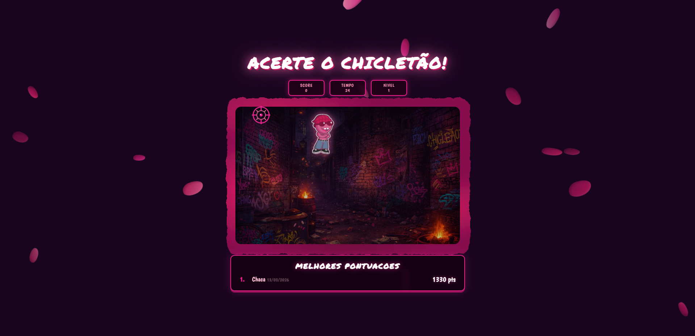
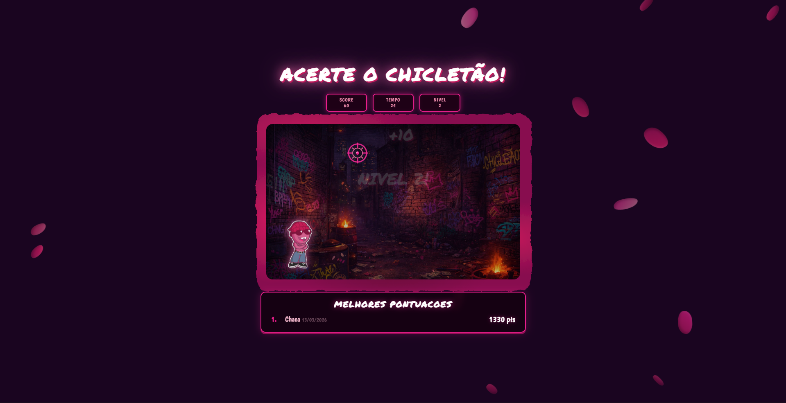
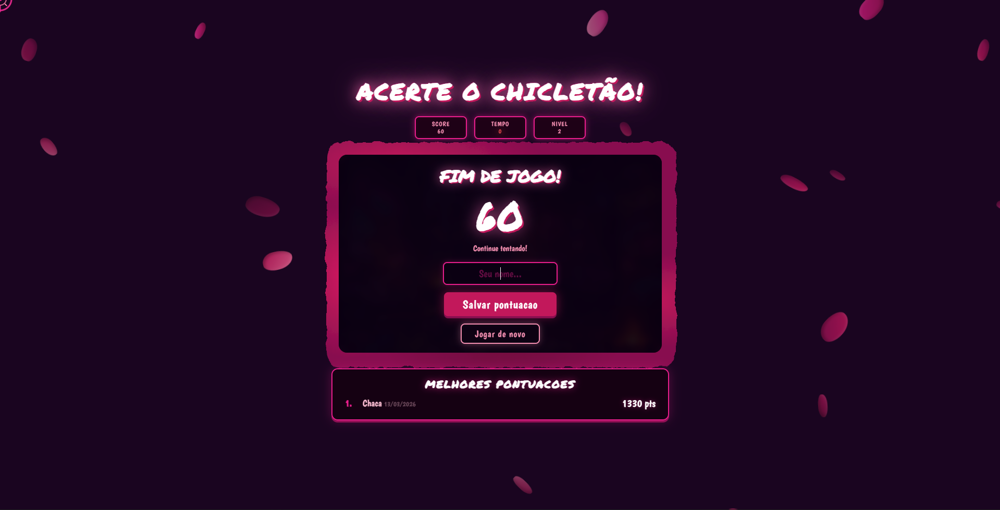
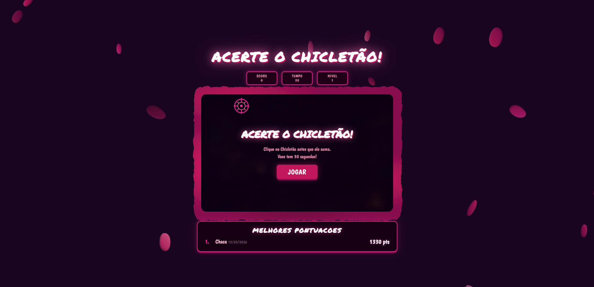

# 2D Browser Shooter

A fast-paced 2D shooter game that runs directly in the browser using HTML, CSS, and JavaScript.

🎮 Play the game:  
http://r7chaca.github.io/2d-browser-shooter/

---

## Screenshots

### Gameplay

### Hit Effect

### Score System

### HUD / Interface

---

## Technologies

- HTML
- CSS
- JavaScript
- 
## Screenshots

  
  

  
  

